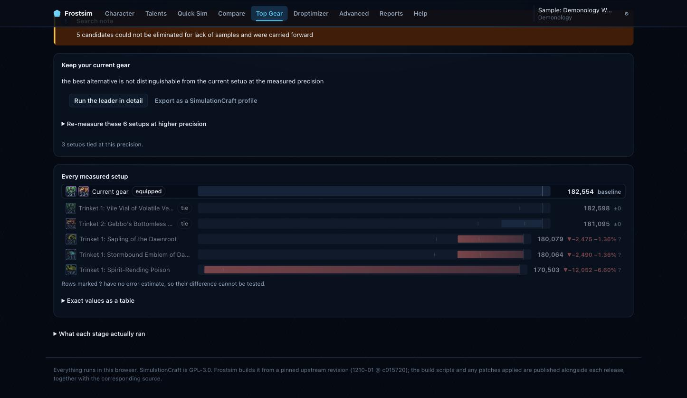
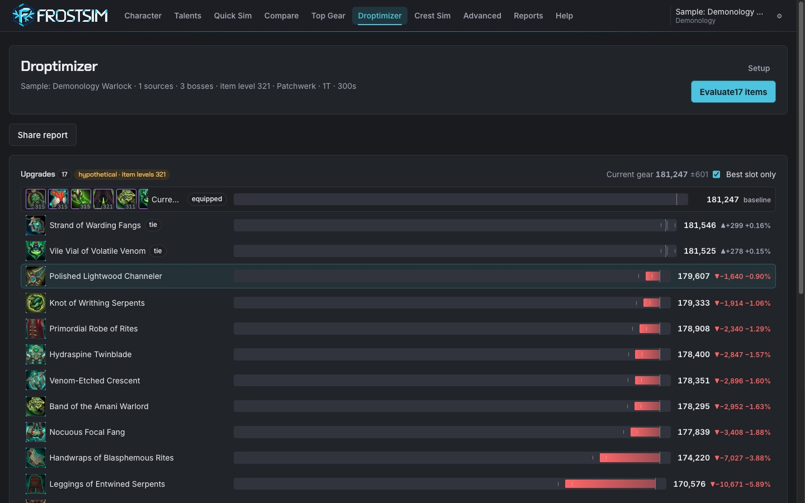
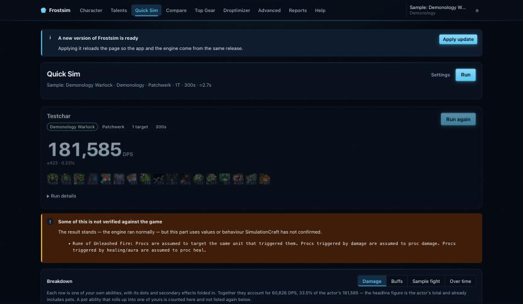
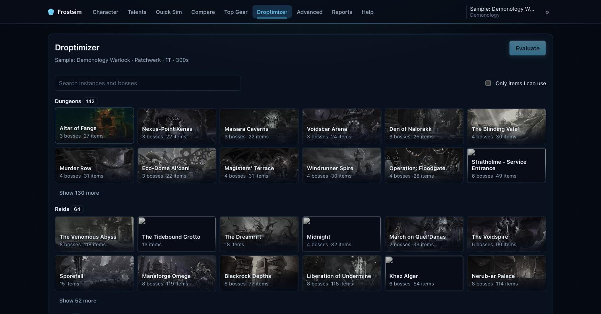
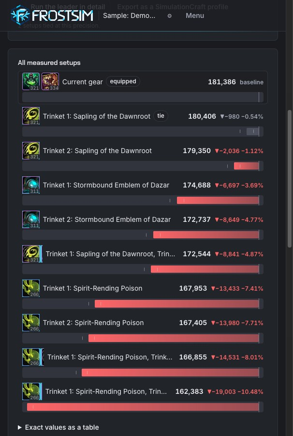
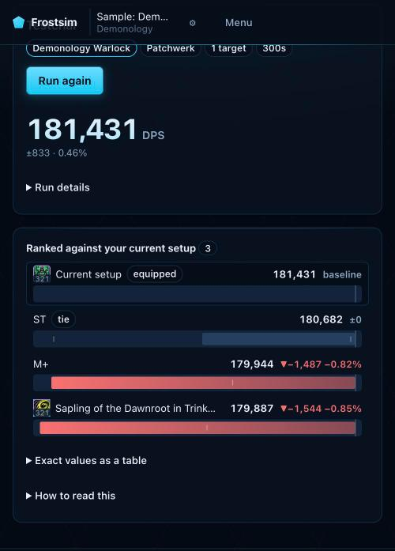

<p align="center">
  
</p>

<p align="center">
  <strong>SimulationCraft, running entirely in your browser.</strong><br>
  Gear, upgrade and crest decisions simulated on your own machine. No sim backend, no queue, no waiting behind anyone else.
</p>

<p align="center">
  
  
  
</p>

<p align="center">
  
</p>

## Your CPU, your sim

Frostsim is a browser-only alternative to a hosted simulation service. SimulationCraft is compiled to WebAssembly and runs inside a Web Worker on your machine, using its own iteration split and merge logic across real threads. Nothing about your character is uploaded, no job waits in a queue, and the cost of a thousand sims is your own idle CPU.

**The hard constraint is architectural, not a preference.** There is no server route that can start a simulation. A static host serves the bytes and a small proxy answers item lookups, and that is the entire server side.

Paste your `/simc` addon export, pick what you want to know, and run it.

## What you can simulate

| | In Frostsim |
| --- | --- |
| **Quick Sim** | One profile, one number. Iterations or a target error you choose. |
| **Compare** | Named setups side by side, ranked, with a winner declared only when the engine can actually separate them. |
| **Top Gear** | Every legal combination of the gear you select, searched adaptively and finished with an independent verification of the finalists. |
| **Droptimizer** | Every drop from a boss or dungeon measured against your current gear, with per-item gains and their error bars. |
| **Crest Sim** | What to spend your crests on. Measures each upgrade, solves the budget exactly, then simulates the finished plans in full. |
| **Power Infusion** | What one Power Infusion is worth to each spec from single target to ten, how much of it lands on the main target, and a drawer of charts per spec. Reference data, not your character. |
| **Advanced** | Raw simc options for anything the screens do not cover. |
| **Reports** | Every run is saved locally, reopenable, and shareable as a portable file. |

### A search that spends effort where it matters

A gear search is mostly candidates that are obviously worse. Frostsim runs a cheap first pass over the whole field, eliminates only what is separated by a corrected statistical margin, then re-prices each survivor's precision from how close it sits to the leader. Candidates that remain tied get tighter measurements; candidates far behind are never measured again.

Elimination is deliberately conservative. Overlapping error bars never eliminate anything, a union-bound correction accounts for every comparison and every look, and a field that cannot be separated is reported as an unresolved tie rather than ranked arbitrarily. Against a synthetic ground truth the search records zero false eliminations across every population and noise level tested, and it stops discarding the true best candidate when the budget runs short: at 500 candidates that failure rate goes from 3.3% to zero.

<p align="center">
  
</p>

### Crests, spent properly

The Crest Sim answers a question a stat weight cannot: given what you hold and what you can still earn, which upgrades buy the most damage?

It simulates each item at its top reachable rank, derives the intermediate ranks by interpolation, solves an exact multi-budget knapsack over the crest types, then simulates the finished plans in full so the headline number is measured rather than added up. Upgrade costs come from the game's own data tables at a pinned client build, including the high-watermark discount. Where the game does not publish a number, Frostsim asks you for it instead of inventing one.

### Power Infusion, per spec and per target count

A priest deciding who gets Power Infusion wants two numbers: how much damage it adds, and whether that damage lands on the boss or spreads over the adds. The Power Infusion page shows both at 1 to 10 targets for every spec SimulationCraft ships a default profile for, each with its 95% margin of error. Beast Mastery and Marksmanship Hunters and Subtlety Rogues get a second row with SimulationCraft's priority-target option on, which answers how much of Power Infusion's gain a funnel build puts into the main target.

Each spec opens a drawer: damage per second over the fight with and without Power Infusion, when it was up, what it added second by second, the gain from 1 to 10 targets, where the damage comes from, and which abilities and pets the extra damage came from. The breakdown is the same one Quick Sim uses, so pets and child spells are counted the same way. Charts and each spec's data load only when a drawer is first opened, and the hashed files are cached by the browser after that.

This is the one place Frostsim shows numbers it did not simulate on your machine. The page ranks every spec on SimulationCraft's default profiles, which is shared reference data rather than anything about you, so it is simulated once, offline, and shipped as static JSON stamped with the engine commit. No server runs a sim for it.

<details>
<summary><strong>More screens</strong></summary>

<p align="center">
  
  
</p>
<p align="center">
  
  
</p>

</details>

## Nothing here is hand-maintained game data

Item stats, spell coefficients and set bonuses come from the client data tables compiled into the engine binary. Item catalogs, upgrade tracks and crest costs are generated from pinned sources and verified against that same binary, with every source recorded by URL and hash. A hardcoded item or spell number in the application code is treated as a bug.

When a number genuinely is not available, it is reported as unavailable and named. The season's weekly crest cap is the current example: no client table carries it and no official announcement states it, so Frostsim will not supply one.

## How it fits together

Three layers, deliberately separate.

The **engine** is SimulationCraft, configured rather than forked. It is built from a checkout pinned in `engine.lock.json` with networking and the PTR data tables compiled out, and it ships as a single WebAssembly artifact plus a manifest recording its identity, capabilities and hashes. A second single-threaded artifact exists for environments that cannot provide `SharedArrayBuffer`. Engine changes, on the rare occasion they are unavoidable, live in `patches/` as diffs applied at build time.

The **translation layer** is plain TypeScript and holds the actual product: a character and its settings become simc profile text and option arguments, and a simc JSON report becomes typed results. It has no WebAssembly dependency, which is what makes it testable on its own, and every parser, serializer and statistical change carries a test.

The **UI** is Svelte 5. Each sim is a screen over the same job lifecycle, engine slot and progress reporting.

One module instance serves exactly one run. The engine's data initialization and effect registries are global, so a fresh instance is created per run from a cached compiled module, which also makes cancellation a worker terminate.

## Running it yourself

```sh
npm ci                   # Node >= 26
npm run engine:bootstrap # fetch the pinned SimulationCraft checkout
npm run engine:build     # build the WebAssembly engine (needs emsdk)
npm run dev
```

The engine build needs the Emscripten SDK and takes a while on a first run; the source checkout alone is 360 MB and the client data tables are larger. `engine.lock.json` pins the upstream commit and the toolchain, and the build refuses to run against anything else. Build output and generated catalogs are not committed, so a fresh clone builds them before the app will run.

| | |
| --- | --- |
| `npm run dev` | Vite, with the isolation headers the engine requires |
| `npm run serve:pages` | Serves a build the way production does, including the real content security policy |
| `npm test` | The translation layer, no WebAssembly needed |
| `npm run check` | Type and template checking |
| `npm run catalog:build` | Regenerate item, talent and upgrade catalogs from the pinned checkout |
| `npm run data:power-infusion` | Re-simulate the Power Infusion data after a patch (see below) |
| `npm run test:data` | Tests for the Power Infusion generator |

### Regenerating the Power Infusion data

`scripts/generate_power_infusion.py` simulates every spec's default profile at 1 to 10 targets, with and without Power Infusion, and with the funnel option on for specs that have one: about 630 simulations, roughly 90 minutes on a 16-thread machine. It refuses to run unless the checkout and the built engine match `engine.lock.json`. After a patch:

```sh
npm run engine:bootstrap          # after bumping engine.lock.json
npm run engine:build
npm run data:power-infusion       # or: python3 scripts/generate_power_infusion.py --tier MID3
```

It needs Python 3.9 or newer and nothing else, and runs on macOS, Linux and Windows (`py scripts/generate_power_infusion.py`). `npm run engine:bootstrap` works everywhere; `npm run engine:build` needs bash and emsdk. A machine without them can skip the build: the engine the generator runs is WebAssembly, so copy `build/wasm/simc-node.cjs` and `build/wasm/simc-node.wasm` from a machine that built them. Every report's engine commit is checked against `engine.lock.json`, so a stale copy fails on its first sim. In a terminal it shows a live dashboard: progress, time left, the sims running now, every spec's progress by target count, and the machine's CPU and memory. `p` pauses, `+` and `-` change how many sims run side by side, and `q` stops after the running sims. Finished specs are written as they complete, so an interrupted run picks up where it stopped. `--specs "Frost Mage,Outlaw Rogue"` runs a subset, `--plain` prints one line per sim, and `--help` lists the rest.

**Verify anything visual against `serve:pages`, never only `dev`.** The production policy is deliberately not applied to the dev server, so a change can look correct there and fail in production.

### What a host has to provide

Threaded simulation needs `SharedArrayBuffer`, which needs cross-origin isolation, which needs a host that can set response headers: `Cross-Origin-Opener-Policy: same-origin` and `Cross-Origin-Embedder-Policy: require-corp`. A host that cannot set them is unusable, and static hosts that cap individual assets below the engine's size are unusable for the same reason.

Trusted HTTPS is part of the same requirement rather than a separate nicety. A self-signed certificate costs the page its isolation, which silently demotes every visitor to the single-threaded engine.

`public/_headers` holds the policy the app expects, and `npm run serve:pages` applies it locally so it can be checked before it reaches a real host.

## Built with

[Svelte 5](https://svelte.dev), TypeScript and [Vite](https://vite.dev) for the application. [SimulationCraft](https://github.com/simulationcraft/simc) compiled with [Emscripten](https://emscripten.org) for the engine, running on pthreads inside a Web Worker. [Vitest](https://vitest.dev) for the translation layer.

## License

[GPL-3.0-only](LICENSE), inherited rather than chosen.

SimulationCraft is GPL-3.0 and grants no later version, and the engine here is a compiled derivative of it. The application does not call that engine at arm's length: its own worker loads the Emscripten glue into its scope, calls the program's entry point directly and reads the report out of its in-memory filesystem. What gets distributed is therefore one combined work, and the terms that reach a recipient are the GPL's. Declaring anything more permissive would describe rights nobody actually receives.

Two practical consequences. Any deployment must make the corresponding source for its exact engine binary as available as the binary itself. And anyone distributing a modified Frostsim owes recipients the same freedoms on the same terms.
